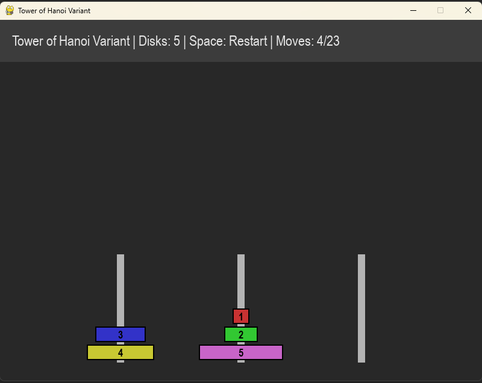

# Tower of Hanoi Variant — Pygame Visualization

**Author:** Fadil Eldin  
**Date:** July 12, 2025

A Python/Pygame visual solver for a Tower of Hanoi variant:  
- **Start from any valid random configuration** (not just all disks on the leftmost pole).
- **Goal:** Move all disks to the rightmost pole — largest at the bottom, smallest at the top.
- **Auto-solves** from any valid initial state.
- **Interactive panel:**  
  - **Space bar**: Restart with a new random (valid) configuration.
  - **Move counter** and instructions shown at the top.

---

## Features

- **Generalized Initial State:**  
  At each restart, disks are randomly distributed among the three poles, but always stacked legally (no large disk atop a small one).
- **Always Solvable:**  
  Uses BFS to find the shortest solution sequence for any valid initial state.
- **Visualization:**  
  See each step of the auto-solver as disks move pole-to-pole.
- **Pygame-based GUI:**  
  - Move counter, disk count, and instructions displayed on a panel.
  - Clean, colorful rendering of disks and poles.
- **Educational:**  
  Observe how the classic puzzle adapts when not starting from the standard state.

---

## Controls

| Key         | Action                                        |
|-------------|-----------------------------------------------|
| `Space bar` | Restart with a new random valid configuration |
| `ESC`/Close | Quit program                                  |

---

## Screenshot

**

---

## Installation

**Python 3.8+ is required.**  
Install dependencies:

```bash
pip install -r requirements.txt
```

---

## Usage

```bash
python other_hanoi_pygame.py
```

- The program starts with a random valid configuration.
- Disks are auto-moved to the rightmost pole.
- Press `Space` to try another random challenge at any time!

---

## Requirements

See [`requirements.txt`](requirements.txt):

- `pygame`

---

## Implementation Notes

- **Random State Validity:**  
  Each restart shuffles disks among poles, but ensures no large disk is placed atop a smaller one.
- **Solution Algorithm:**  
  Breadth-First Search (BFS) is used to find the shortest sequence of legal moves from the current state to the goal.
- **Disk Drawing Order:**  
  Disks are drawn from bottom to top for each pole, with color and disk number labels.
- **No User Disk Dragging:**  
  This demo is auto-solve only; it's not a manual Tower of Hanoi game.

---

## Customization

- **Change disk count:**  
  Edit the `disk_count` variable in `main()` to increase/decrease puzzle difficulty.
- **Colors, window size, speed:**  
  Change constants at the top of the script to tweak appearance and animation speed.

---

## Acknowledgments

- [Pygame](https://www.pygame.org/) for the graphics library.
- Thanks to Claude and Copilot for bugfixes and suggestions.

---

## License

MIT License.

---

## Author

[Fadil Eldin](https://github.com/FadilEldin)
