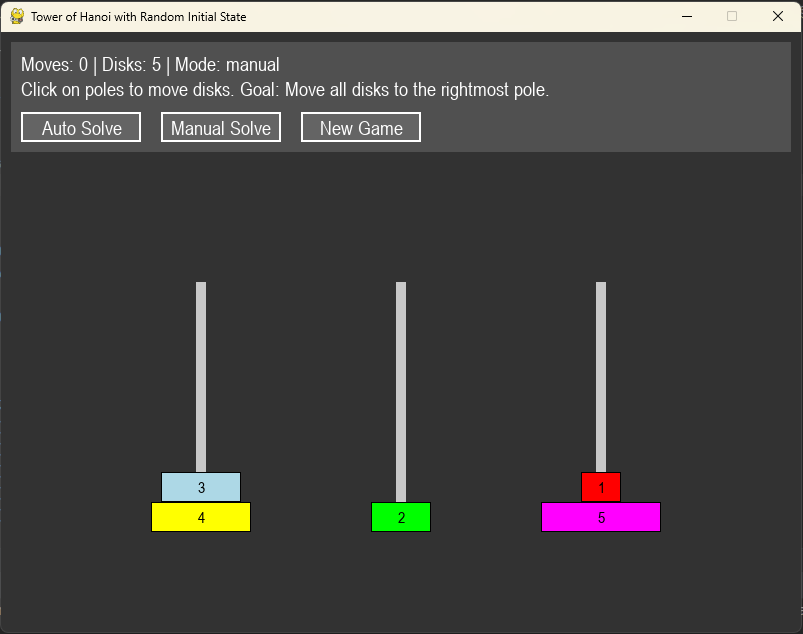

# Tower of Hanoi with Random Initial State (Pygame)

A visual and interactive Tower of Hanoi puzzle game in Python using Pygame, featuring:

- **Random initial states** (always valid, with smaller disks above larger ones)
- **Manual mode** (user solves the puzzle)
- **Auto-solve mode** (the program finds & plays the solution from any valid state)
- **Restart anytime** (press Space bar for a new random challenge)
- **Disk numbering** and clear color visualization
- **User-friendly interface** with info panel and mode buttons

---

## Features

- **Variation:** Start from *any* valid configuration—disks can be split across any poles, as long as no disk is on a smaller one.
- **Always solve to the rightmost pole.**
- **Easy controls:** Click poles to move disks in manual mode.
- **Auto-solver:** Uses BFS to find the shortest move sequence from any state to the goal.
- **Disk numbers:** Each disk is clearly numbered for easy tracking.
- **Modes:** Switch instantly between manual (user) and auto (program) solving via panel buttons.
- **Panel:** Top-left corner displays moves, disk count, and mode. Buttons for mode switching and new games.
- **Replayability:** Press `Space` to restart with a new random (but always solvable) arrangement.

---

## How to Play

1. **Run**:  
   ```
   python hanoi_pygame.py
   ```
2. **Manual Mode**:  
   - Click on a pole to select the top disk.
   - Click another pole to move the disk there (if the move is valid).
   - Objective: Move all disks to the rightmost pole.
3. **Auto Mode**:  
   - Click the "Auto Solve" button in the panel to watch the program solve the puzzle from the current configuration.
   - Click "Manual Solve" to return to user play.
4. **New Game / Random State**:  
   - Press the `Space` bar or click "New Game" to generate a fresh random (always valid) initial state.

---

## Requirements

- Python 3.7+
- [pygame](https://www.pygame.org/)

Install requirements via:

```
pip install -r requirements.txt
```

---

## Project Files

- `hanoi_pygame.py` &mdash; Main program (see code)
- `requirements.txt` &mdash; Python dependencies
- `README.md` &mdash; This file

---

## Customization

- **Change number of disks:**  
  Adjust the `disk_count` variable in `main()` (default is 5, supports 3 to 8).
- **Colors:**  
  Disk and UI colors are set as constants near the top of the script.

---

## Implementation Notes

- **Randomized start:**  
  Disks are randomly distributed across poles but always stacked in decreasing size order, per Tower of Hanoi rules.
- **Auto Solver:**  
  Uses Breadth-First Search (BFS) to guarantee the shortest solution from *any* valid starting state to the goal.
- **Validity:**  
  The game enforces the rule: No disk may be placed on top of a smaller disk at any time, for both manual and auto moves.
- **Restarting:**  
  The game can be restarted at any time without restarting Python.

---

## Acknowledgements

- Created by Fadil Eldin, July 2025
- Prompted and iterated with help from DeepSeek, GitHub Copilot, Claude, and ChatGPT

---

## License

MIT License (or specify your own)

---

## Screenshot

**

---

## Troubleshooting

- If you get "No module named 'pygame'", install it via `pip install pygame`.
- Make sure your Python version is 3.7 or higher.

---

Enjoy solving (or watching the auto-solver) the Tower of Hanoi in a whole new way!