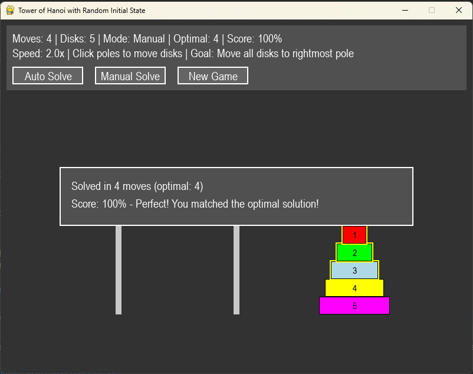

# Tower of Hanoi (Random Initial State) - Pygame Visualization

A visual and interactive implementation of the Tower of Hanoi puzzle with a twist:  
You can **start from any valid random initial state**, and the goal is always to move all disks to the **rightmost pole**.

## Features

- **Random Initial State:** Disks are placed randomly (but validly) on the three poles at the start.
- **Two Modes:**
  - **Manual:** Play and solve the puzzle yourself by moving disks.
  - **Auto:** Watch the shortest solution found for the current state.
- **Optimal Moves Calculation:** Shows the minimal number of moves required from the current state (using BFS).
- **Scoring:** Get a score based on how close you are to the optimal solution.
- **Interactive GUI:** Click to select and move disks, or use buttons to switch modes or start a new game.
- **Customizable Disk Count:** Easily modify the number of disks between 3 and 8.

## Controls

- **Click on Poles:** Select the source and destination poles to move disks (in manual mode).
- **Auto Solve Button:** Instantly shows the optimal solution for the current puzzle.
- **Manual Solve Button:** Switches back to manual mode at any time.
- **New Game Button:** Generates a new random valid starting arrangement.
- **Spacebar:** Quick restart with a new random state.

## How to Run

1. **Install Python:**  
   Make sure you have Python 3.x installed.

2. **Install pygame:**  
   ```
   pip install pygame
   ```

3. **Save the code:**  
   Save the provided `TowerOfHanoi.py` code to your computer.

4. **Run the game:**  
   ```
   python TowerOfHanoi.py
   ```

## Code Structure

- **Disk:** Class representing an individual disk, including drawing and selecting.
- **Pole:** Represents a pole (stack), manages its disks.
- **Button:** Simple interactive UI button.
- **HanoiGame:** Main game logic, UI rendering, move validation, state generation, and solution finding.
- **main():** Initializes the game, manages events and the main loop.

## Game Rules

- Only one disk can be moved at a time.
- A disk can only be placed on top of a larger disk (or an empty pole).
- The goal is to stack all disks, in order, on the **rightmost pole**.

## Screenshots

**

## Customization

- **Change Number of Disks:**  
  Edit `disk_count = 5` in the `main()` function to select any number between 3 and 8.

## Attributions & License

- **Author:** [Fadil Eldin](https://github.com/FadilEldin)
- **Date:** July 12, 2025
- **License:** MIT

---

Enjoy solving the Tower of Hanoi from any random starting position!